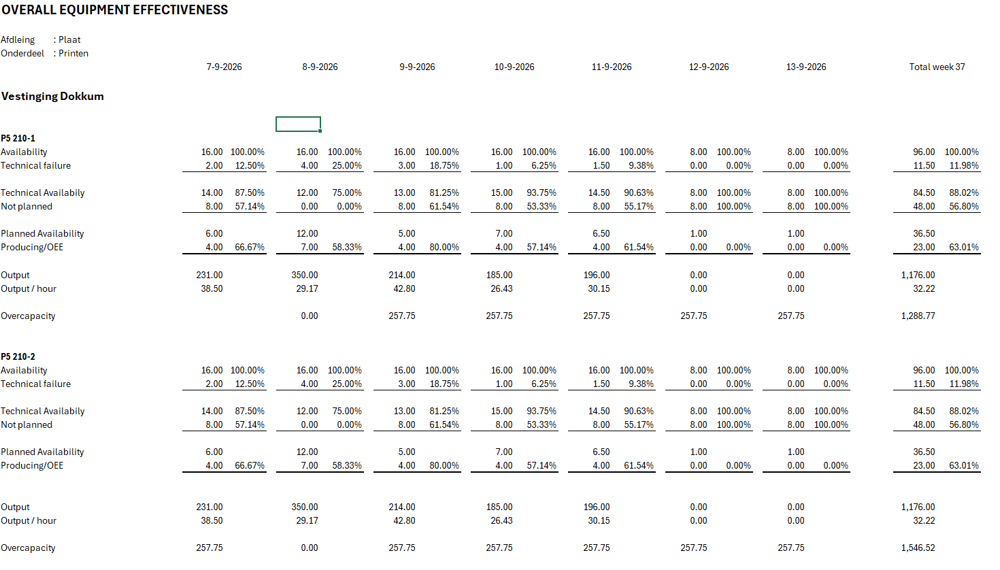

# handoff: oee_report — wat er in de config veranderd is

Data_group `oee_report`, layout `flow-board`, data uit `get_oee_report`. Filter:
`oee_report_filter`. Pagina `oee-report`. Zo moet het eruitzien:

## src `get_oee_report`

| param | type | |
|---|---|---|
| `date` | date | nieuw, vervangt `until`, `default_value now()`; de read geeft die dag + 4 werkdagen ervoor + een totaalrij; de url-key is `date` |
| `step` | text | nieuw, `default_value print`; select print / coat / cut in het filter |
| `line_type`, `tenant_ids` | | ongewijzigd |

Nieuwe kolom `report_key` (de dag als tekst, of `aggregated`): de kolomsleutel van de grid.
Nieuwe kolom `set`: `resource` (een machine) of `summary` (de totaalrij van de vestiging, per dag en
geaggregeerd; `resource_uid` `tenant-<id>`, `resource_path` null, `resource_name` de vestiging). De
read levert die rij als laatste van de vestiging.
`i18n.title` is de kolomtitel. Elke rij heeft `param_json` (invoer én uitkomst van de regels, één
object) en `formula_json` (de regels); alle velden op het bord zijn `param_json.*`. Er is geen
`oee_json` meer.

De rijen komen per vestiging op `resource_name`, de summary als laatste. `param_json.shifts` is
een array met per dienst van de rij (`shift` day / evening / night, `i18n` de titel) dezelfde
invoer en dezelfde regel-uitkomsten, op de server gerekend; de platte keys zijn de totalen.

## flow_board_config

| laag | key | waarde | nieuw |
|---|---|---|---|
| `flow-grid` | `group_by` | `["report_key"]` | groeperen op een veld, één kolom per key |
| | `group_title_fields` | `["i18n"]` | de kolomtitel |
| | `row_options.label_column` | `true` | de labels één keer, als eerste kolom vóór de grid-kolommen; de cellen tonen alleen waarden |
| | `row_options.label_column_width` | `270` | breder dan de datakolommen (200-260) |
| | `row_options.label_column_sticky` | `true` | die labelkolom blijft in beeld bij horizontaal scrollen |
| | `row_options.full_grid_scroll` | `true` | één verticale scroll voor de hele grid, niet per kolom |
| | `row_options.class_name` | `border-0 divide-y-0 shadow-none` | geen randen |
| `flow-container` | `sort` | `{field: tenant_id, direction: asc}` | |
| | `row_options.class_name` | `rounded-none border-0 shadow-none` | geen rand om de vestiging |
| `flow-cards` | `group_by` | `["resource_uid"]` | was `resource_path` (null op de summary-rij) |
| | `set_field` | `set` | de soort kaart, als op de timeline |
| | `set_overrides.summary` | `{row_options, field_config}` | de summary-kaart: eigen `class_name` met `flow-card-summary`, titel via template `Totaal ${tenant_name}`, de drie operator-velden `hidden false`, de input gestyled; geen client-side aggregatie, geen `summary`-feature |
| | `evaluate` | `{formula_field: formula_json, params_field: param_json}` | de regels per kaart op het bord gerekend, de uitkomsten in `params_field` zelf (geen aparte result-key); ook op de summary-kaart en na een `input` |
| | `row_options.class_name` | `rounded-none border-0 p-1 shadow-none` | |
| | `items` | `{data_field: param_json.shifts, title_field: i18n, key_field: shift}` | nieuw: een veld toont één cel per element (de dienst) in plaats van de rij-waarde; kolomkoppen uit `i18n` van de elementen |
| | veld `ui.no_items` | `true` | het veld neemt de rij-waarde, niet één per element: de percentages, de titel en de operator-velden; zo staan er twee of drie dienst-kolommen en één percentage-kolom, geen totaalkolom |
| | `fields_class_name` | `grid gap-x-2` | het aantal kolommen volgt uit de items + 1 |
| alle lagen | `row_options` | `colexp false, checkable false, selectable false` | alles open, geen vinkjes |

De `flow-table` onder de kaart is weg: de velden staan op de `flow-cards` zelf,
`fields_class_name grid grid-cols-2 gap-x-2 text-right` (twee even brede kolommen, getallen rechts), `resource_name` bovenaan.
Elke waarde staat in kolom 1 (`col-start-1 text-right`, dus elke waarde begint een nieuwe rij), het
percentage erachter in kolom 2 (geen class, links). De eerste rij van elke groep van het blad heeft
`mt-2` op beide cellen (technische beschikbaarheid, geplande beschikbaarheid, output, overcapaciteit,
operators); de labelkolom volgt dezelfde marges. De drie operator-velden staan er met
`ui.hidden true`, de override zet ze op `false`.

## velden

| veld | key | |
|---|---|---|
| `param_json.planned_operators` | `ui.control input`, `ui.type number` | nieuw: een zichtbaar invoerveld (de control zelf; in de override `col-span-1`, de rijen erna `col-start-1`); na wijziging `evaluate` opnieuw op die kaart |
| `param_json.planned_operators`, `param_json.planned_operator_cost`, `param_json.operator_cost_per_sqm` | master `ui.hidden true`, in `set_overrides.summary` `ui.hidden false` | alleen op de summary-kaart |
| `set` | `ui.hidden true` | |
| `param_json.shift_duration`, `param_json.offline` | zichtbaar, boven `availability` | nieuw op de kaart: diensttijd, offline, beschikbaarheid |
| `param_json.actual_net_output_sqm`, `param_json.actual_gross_output_sqm` | hernoemd / nieuw | `actual_output_sqm` heet nu `actual_gross_output_sqm`; `actual_net_output_sqm` (klantorders) staat er direct boven |
| `param_json.shifts` | `ui.hidden true` | de items-bron |
| `param_json.output_per_planned_hour` | nieuw | output / geplande beschikbaarheid, boven de bestaande output / producerend uur |
| `param_json.actual_output_per_hour` | `class_name` met `text-gray-400` | lichter: onze maat naast die van het blad |
| `param_json.output_per_operator`, `param_json.planned_printers_per_operator` | master `ui.hidden true`, in `set_overrides.summary` `ui.hidden false` | nieuw, alleen op de summary-kaart |
| `param_json.period_output_per_planned_hour` | `ui.hidden true` | invoer van de overcapaciteit-regel |
| elk veld `ui.type duration` | `ui.format` | `hh:mm` |
| velden met een eenheid | geen `suffix` meer | de eenheid staat in het label: `Output (m²)`, `Operatorkosten (€)`; de waarde is kaal |

## filter `oee_report_filter`

| veld | key | |
|---|---|---|
| `date` | `ui.control date-picker`, `ui.type date` | nieuw: één datum, de enkelvoudige van `multi-date-picker`; vervangt `dates` |

## antwoorden op de vragen van 14 sep

- uitkomsten: in `param_json`, geen `oee_json`, geen `result_field` (de read doet hetzelfde)
- uren: `type duration` met `format hh:mm`, geen decimalen
- de matrix is vol: de read maakt elke resource × elke dag (cross join), ook zonder data, en de
  totaalrij per resource; de labelkolom kan daarop vertrouwen
- `date-picker` is inderdaad nieuw; het is de enige enkelvoudige
- `window_class_name p-8` staat ook op andere data_groups (o.a. nest_waste_ranges)
- de invoer op de summary-kaart: de summary is nu een echte rij van de read (`set summary`), dus de
  input heeft gewoon een rij; lokale state is niet meer nodig
